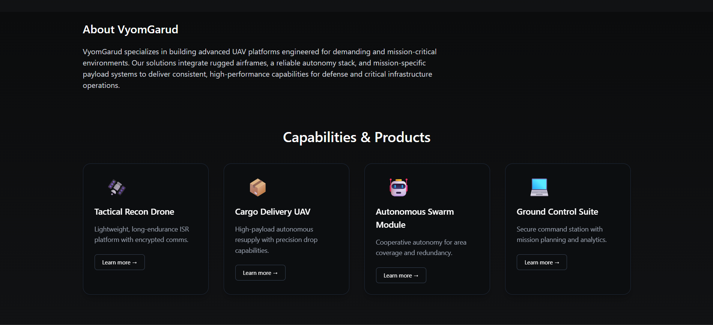

# VyomGarud – UAV Systems Landing Page

A modern and responsive landing page built for **VyomGarud**, a military-grade UAV & drone systems company.  
Designed with a dark, futuristic and high-precision theme using **React + Vite + Tailwind CSS**.

---

## 🚀 Tech Stack
- React (Vite)
- Tailwind CSS
- Framer Motion (optional animations)
- Responsive Layouts (Flex + Grid)

---

## 🎯 Features
- Hero section with title, tagline & CTA  
- About section describing VyomGarud’s mission  
- Capabilities / Products section with 3–4 cards  
- Highlights section with key features  
- Clean footer / contact section  
- Fully responsive (Mobile / Tablet / Desktop)  
- Smooth fade-in animations  

---

## 📂 Project Structure

🚀 Tech Stack

React (Vite)

Tailwind CSS

Framer Motion (optional animations)

Responsive Layouts (Flex + Grid)

🎯 Features

Hero section with title, tagline & CTA

About section describing VyomGarud’s mission

Capabilities / Products section with 3–4 cards

Highlights section with key features

Clean footer / contact section

Fully responsive (Mobile / Tablet / Desktop)

Smooth fade-in animations

## 📸 Screenshots

### 🟧 Hero Section

### 🟧 Capabilities / Products

### 🟧 Mobile View

## 🎥 Project Preview GIF

